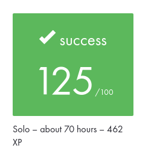

# Academic Project Context

## Project Record

| Field | Value |
| --- | --- |
| Project | `Libft` |
| Curriculum | 42 Common Core |
| Supplied subject reference | Version 19.3 |
| Final evaluation | **125/100** |
| Project type | Individual |
| Estimated curriculum workload | About 70 hours |
| Curriculum XP | 462 XP |

## Evaluation

The original 42 project received a final evaluation of **125/100**.

The image is a cropped record of the original 42 Intra evaluation result.
It intentionally excludes evaluator identities, peer comments, internal
repository information, private URLs, navigation elements, and unrelated
platform statistics.

## Subject Reference

The subject document supplied for this portfolio documentation pass identifies
itself as:

- **Project:** Libft
- **Subtitle:** Your very first own library
- **Version:** 19.3

The original subject PDF is not redistributed in this public repository.

Version 19.3 is recorded here as the supplied documentary reference. This
repository does not claim that the supplied PDF can independently prove the
exact subject revision present on the original evaluation date.

## Repository History

This repository began as my original academic implementation of the 42 Common
Core Libft project.

The current `main` branch is a maintained portfolio edition. It contains later
professionalization work including testing, CI, API documentation,
maintainability improvements, and reusable dependency guidance.

The annotated tag `portfolio-baseline-2026-09` preserves the repository state
immediately before the structured professional portfolio modernization.

The tag `v1.0.0` identifies the first maintained portfolio release. Later
maintenance and documentation may exist on `main` without moving or rewriting
that release tag.

## AI Usage

### Original academic development

No AI tools were used during the original academic development of Libft.

The implementation, debugging, testing, and project understanding required for
the original project were completed without AI assistance.

### Portfolio modernization

AI was introduced only later, during the professional modernization of the
repository.

It was used as an engineering assistant for activities including:

- systematic repository and code audits;
- maintainability review;
- test and validation planning;
- CI and GitHub workflow planning;
- documentation design and review;
- dependency-integration guidance;
- portfolio-wide consistency work.

AI-assisted suggestions were reviewed against the actual implementation and
validated before integration.

AI use in the modernization phase should not be interpreted as AI involvement
in the original academic implementation.
